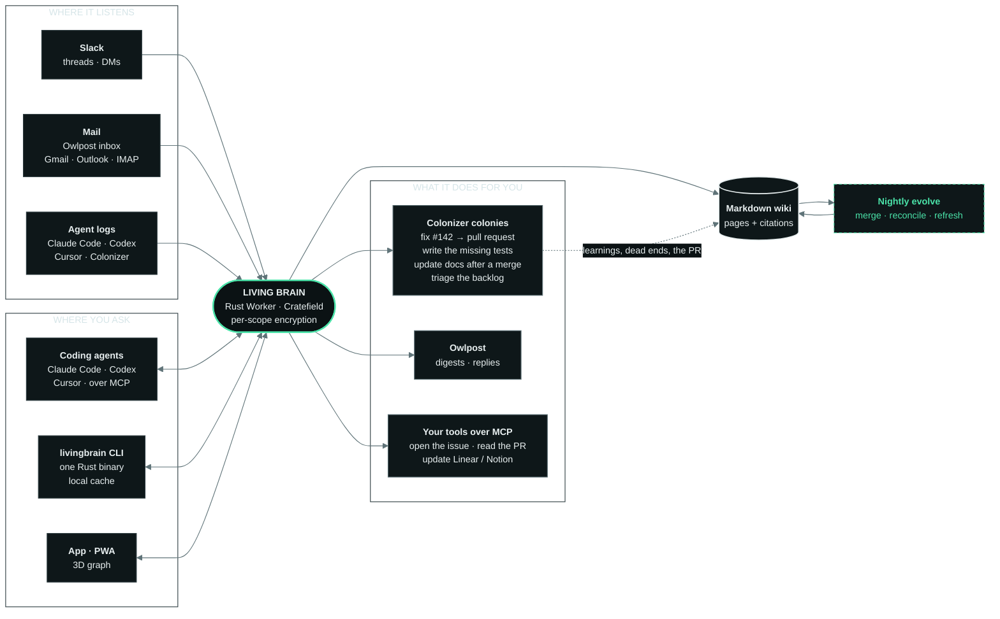

  

  <b>A brain for your team that writes its own company wiki, and keeps improving it.</b> 
  In Slack, in your coding agent over MCP, and in your terminal. One blazing-fast Rust binary. Plain Markdown you own.

  
  
  
  
  
  

  <a href="https://livingbrain.wiki">livingbrain.wiki</a>
  &nbsp;·&nbsp;
  <a href="https://github.com/Livingbrain-wiki/livingbrain/issues">The plan, as issues</a>
  &nbsp;·&nbsp;
  <a href="docs/issues/">Issue specs</a>
  &nbsp;·&nbsp;
  <a href="https://livingbrain.wiki/llms.txt">llms.txt</a>
  &nbsp;·&nbsp;
  <a href="https://factory0.ventures">Factory Zero</a>

> **Planned. Nothing here runs yet.** The plan is four epics and 42 issues in the
> [issue tracker](https://github.com/Livingbrain-wiki/livingbrain/issues); code lands issue by issue.
> Early access is a waitlist at [livingbrain.wiki](https://livingbrain.wiki).

---

## What it will be

| | |
| :--- | :--- |
| **Remembers** | Turns Slack conversations into Markdown pages for people, projects, decisions and customers. Every fact links to its source message. |
| **Evolves** | Nightly passes merge duplicates, surface contradictions and refresh stale facts. A learning layer models how each person works. |
| **Acts** | Tools over MCP. Bigger jobs go to a [Colonizer](https://colonizer.dev) colony that comes back with a pull request. |
| **Everywhere** | Slack first. Everywhere else through MCP (Claude Code, Codex, Cursor, OpenCode, Claude Desktop) or the `livingbrain` CLI: one static Rust binary with instant startup and a local cache. |
| **Coding agents** | A Claude Code plugin with skills, slash commands and opt-in hooks. The CLI gathers every agent's session logs (Claude Code, Codex, Cursor, OpenCode, Colonizer) into one searchable, costed record, redacted on your machine and uploaded only if you opt in. |
| **Private by design** | It reads only with the asker's own access, in Slack, over MCP and in the CLI alike. Each scope (shared, a channel, a person) is encrypted with its own key, so search stays scoped and fast, and deleting a key erases that memory everywhere. |
| **Easy to use** | An installable app (PWA) for phone and desktop: one search-or-ask box, offline reading, and the 3D brain one tap away. `livingbrain view` opens the same 3D brain from the CLI. |
| **Yours** | The wiki exports as plain Markdown and opens in Obsidian. Choose your own models on every plan, per role (Anthropic, OpenAI, OpenRouter, your LiteLLM gateway, any OpenAI-compatible endpoint). Crew also includes DeepSeek. |

## How it will work

## Pricing (planned, open core, per workspace)

| Plan | Price | What you get |
| :--- | :--- | :--- |
| **Community** | Free | Self-hosted on your own Cloudflare account and model key, up to 5 people, all core features. Storage: yours, no limit from us |
| **Teams** | $5/mo | Unlimited people, plus SSO, admin and audit log, shared prompt library, per-channel policies. Self-hosted with a license key, or hosted with your own model key. Hosted: 10 GB included |
| **Crew** | $9/mo | Hosted, DeepSeek included or bring your own model, up to 25 people, team features included, 25 GB included |

Storage covers wiki pages, sources, search indexes and aggregated agent logs. Extra hosted storage: $0.25 per GB a month.

## Stack

Rust, built as a [Cratefield](https://github.com/Cratefield/harness) venture: one Cloudflare Worker with D1, R2, KV and a
Durable Object. Modules only see ports; adapters are the only vendor-aware code. Email goes through
[Owlpost](https://owlpost.pages.dev). The design reference is supermemory's
[Company Brain](https://github.com/supermemoryai/company-brain) (Apache-2.0); the design is ported, not the code.

## The plan

Four epics, drafted in [`docs/issues/`](docs/issues/). Edit `specs.py`, regenerate, then file with `file.py`, which
paces its writes.

| Epic | Spec | Scope |
| :--- | :--- | :--- |
| [#1](https://github.com/Livingbrain-wiki/livingbrain/issues/1) | `1-foundation.json` | The brain in Slack: events, permissions, the agent loop, bring your own model, LiteLLM, logging and telemetry (13 issues) |
| [#13](https://github.com/Livingbrain-wiki/livingbrain/issues/13) | `2-living-wiki.json` | The living wiki: pages, citations, search, nightly evolution, learning layer, per-scope encryption, export (9 issues) |
| [#22](https://github.com/Livingbrain-wiki/livingbrain/issues/22) | `3-agents.json` | Agents, Colonizer, Owlpost and the 3D brain, plus waitlist and billing (10 issues) |
| [#33](https://github.com/Livingbrain-wiki/livingbrain/issues/33) | `4-everywhere.json` | Everywhere via MCP and the CLI: one Rust binary, local cache, Claude Code plugin, speed budget, agent log aggregation, PWA, `livingbrain view` (9 issues) |

Issues labelled `needs-harness` are blocked on Cratefield changes: tool calling, an OpenAI-compatible adapter,
embeddings and a vector index.

**Get involved.** Each issue is written so one person or one coding agent can finish it in one pull request. Pick one
whose dependencies are closed.

## Repositories

| Repo | What it is |
| :--- | :--- |
| **livingbrain** | This repo: the product, open core. The plan as issues, and the code as it lands |
| **[website](https://github.com/Livingbrain-wiki/website)** | [livingbrain.wiki](https://livingbrain.wiki): static HTML, no build step, Cloudflare Pages |

## License

Open core. Everything in this repository is [Apache-2.0](LICENSE), except the `ee/` directory (Teams features: SSO,
admin and audit log, shared prompt library, per-channel policies), which will ship under a commercial license and
needs a Teams key to run. Community self-hosting (up to 5 people) is free. See [NOTICE](NOTICE) for attributions.

   
  <a href="https://livingbrain.wiki"><b>livingbrain.wiki</b></a>
  &nbsp;·&nbsp;
  a <a href="https://factory0.ventures">Factory Zero</a> venture

  Listens. Writes. Evolves. Everywhere you work.

