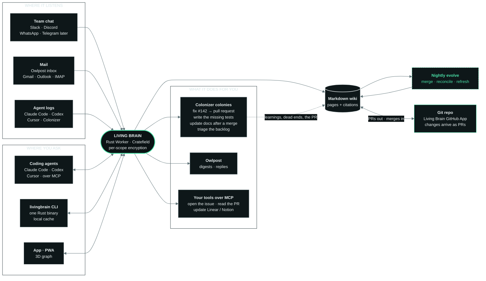

<p align="center">
  
</p>

<p align="center">
  <b>A brain for your team that writes its own company wiki, and keeps improving it.</b><br>
  In your coding agent over MCP, in your terminal, in the app, and in team chat (Slack, Discord). One blazing-fast Rust binary. Plain Markdown you own.
</p>

<p align="center">
  
  
  
  
  
  
</p>

<p align="center">
  <a href="https://livingbrain.wiki">livingbrain.wiki</a>
  &nbsp;·&nbsp;
  <a href="https://github.com/Livingbrain-wiki/livingbrain/issues">The plan, as issues</a>
  &nbsp;·&nbsp;
  <a href="docs/issues/">Issue specs</a>
  &nbsp;·&nbsp;
  <a href="docs/origin-and-plan.md">Origin and plan</a>
  &nbsp;·&nbsp;
  <a href="https://livingbrain.wiki/llms.txt">llms.txt</a>
  &nbsp;·&nbsp;
  <a href="https://factory0.ventures">Factory Zero</a>
</p>

> **Planned. Nothing is live yet.** The workspace scaffold builds and CI runs
> (see [What is built today](#what-is-built-today)), but there is no product
> code and nothing is deployed. The plan is four epics and 54 issues in the
> [issue tracker](https://github.com/Livingbrain-wiki/livingbrain/issues); code lands issue by issue.
> Early access is a waitlist at [livingbrain.wiki](https://livingbrain.wiki).

---

## What it will be

| | |
| :--- | :--- |
| **Remembers** | Turns team conversations (Slack, Discord), mail and agent logs into Markdown pages for people, projects, decisions and customers. Every fact links to its source message. |
| **Evolves** | Nightly passes merge duplicates, surface contradictions and refresh stale facts. They also scan new arXiv papers, news and releases about your stack, and write cited notes on how each could apply to your projects (#58). A learning layer models how each person works. |
| **Acts** | Tools over MCP. Bigger jobs go to a [Colonizer](https://colonizer.dev) colony that comes back with a pull request. |
| **Everywhere** | Coding agents and the terminal first, through MCP (Claude Code, Codex, Cursor, OpenCode, Claude Desktop) or the `livingbrain` CLI, then team chat (Slack and Discord; WhatsApp and Telegram later). The CLI is one static Rust binary with instant startup and a local cache. |
| **Coding agents** | A Claude Code plugin with skills, slash commands and opt-in hooks. The CLI gathers every agent's session logs (Claude Code, Codex, Cursor, OpenCode, Colonizer) into one searchable, costed record, redacted on your machine and uploaded only if you opt in. |
| **Private by design** | It reads only with the asker's own access, in chat, over MCP and in the CLI alike. Each scope (shared, a channel, a person) is encrypted with its own key, so search stays scoped and fast, and deleting a key erases that memory everywhere. |
| **Fewer tokens** | Agents ask for a short cited brief instead of rereading threads and grepping the repo. Context is written once, at night, and reused by every agent. Decisions and dead ends are on record, so agents stop retrying rejected approaches. Yes/no decisions (reply, remember, fetch more, conflict?) go to a fast calibrated judge model (Jev, #53) instead of a large LLM. An [open benchmark](https://github.com/Livingbrain-wiki/livingbrain/issues/48) will measure it; no numbers until then. |
| **Bring your history** | Import your ChatGPT or Claude export with `livingbrain import chatgpt <export.zip>`: read locally, choose what goes in, secrets redacted, kept in your personal encrypted memory. [Guide](https://livingbrain.wiki/guides/import-chatgpt/) |
| **Knows when prod is down** | Connect Grafana or your logs read-only (Loki, Elasticsearch, Datadog, CloudWatch, Cloudflare, Sentry): it answers "is prod down?" with numbers, panel links and a summary of what the logs say, turns alerts into incident pages linked to the deploy, and drafts postmortems. It exports its own metrics, traces and logs over OpenTelemetry. |
| **Safe by design** | Everything it reads is screened for hidden text by [PromptDecode](https://promptdeco.de) before a page is written and again before context reaches an agent. Customers get answers through [SupportGenius](https://supportgeni.us), only from pages you published to them. |
| **Easy to use** | An installable app (PWA) for phone and desktop: one search-or-ask box, offline reading, and the 3D brain one tap away. `livingbrain view` opens the same 3D brain from the CLI. |
| **Yours** | The wiki lives in a git repo too: the Living Brain GitHub App proposes every change as a pull request, and edits you merge flow back in. It exports as plain Markdown and opens in Obsidian. Bring your own LLM on every plan, per role (Anthropic, OpenAI, OpenRouter, your LiteLLM gateway, any OpenAI-compatible endpoint). Crew also includes $3 of DeepSeek credit each month. |

## What is built today

**Nothing is deployed.** Everything below runs locally and in CI; there is no
public endpoint and no product code yet. This section says what exists in the
repository today, and what does not, and is updated as issues land.

| | |
| :--- | :--- |
| **Built** | The Cargo workspace (`crates/livingbrain-*` modules plus `crates/livingbrain-venture`, the Worker), the `livingbrain` CLI (`crates/livingbrain-cli`, a client of the API: `login`, `ask`, `search`, `note`, `page`, `export`, `mcp`), the D1/R2/KV deployment shape in `crates/livingbrain-venture/wrangler.toml`, and CI: fmt, clippy, tests, the Cratefield parity matrix (SQLite + Postgres) for every module, and a wasm build of the Worker. The Worker serves the harness's own `/__health`, and `workspaces`: **sign in with Slack**, one tenant per Slack workspace, the first person in owns it, and a member mirror (#5) |
| **Not built** | Every other product feature: the wiki, permissions, the agent loop, the API the CLI talks to, the app — and, within Slack, the Events webhook that keeps the member mirror fresh (#6). The module set is `canary` (the empty module that proves the scaffold) and `workspaces` |

The composition is one Worker mounting modules into a Cratefield harness; the
venture crate is the only place a runtime or a vendor SDK appears.

```rust
Harness::builder()
    .venture(Venture::new("livingbrain", "api.livingbrain.wiki")
        .public_url("https://api.livingbrain.wiki")
        .cors_origins(["https://livingbrain.wiki", "https://api.livingbrain.wiki"]))
    .module(Canary::new())          // the empty module; real modules are added beside it
    .module(Workspaces::new())      // Slack sign-in and one tenant per workspace (#5)
    .runtime(Cloudflare::new().db("DB").blob("R2").kv("KV"))
    .build()
```

### Develop locally

```sh
cargo test --workspace                    # fmt, clippy and the parity matrix also run in CI
cargo run -p livingbrain-cli -- --help    # the CLI: login, ask, search, note, page, export, mcp
cargo run -p livingbrain-cli -- login     # device flow; the token goes in your OS keychain
cd crates/livingbrain-venture
npx wrangler d1 migrations apply livingbrain --local   # creates the tables (see below)
npx wrangler dev --local                  # builds the Worker to wasm and serves it locally
curl -s http://127.0.0.1:8787/__health    # the harness health route
curl -si http://127.0.0.1:8787/v1/workspaces/slack/start   # 302 to Slack, or 503 without credentials
```

Nothing here is deployed: `wrangler dev` is local only, the D1/R2/KV ids in
`wrangler.toml` are placeholders, and no `wrangler deploy` or `wrangler d1
create` runs anywhere in this repository.

#### Sign in with Slack locally

Slack will only call back over HTTPS, so a local run needs a tunnel in front
of it:

```sh
npx cloudflared tunnel --url http://localhost:8787   # prints https://<name>.trycloudflare.com
```

Then create a Slack app (From scratch) with **OpenID Connect** as the only
user scope, and add `<tunnel>/v1/workspaces/slack/callback` as a redirect URL,
where `<tunnel>` is the URL cloudflared printed. Fill in the two non-secret
placeholders in `crates/livingbrain-venture/wrangler.toml` `[vars]`: the app's
client id, and that same tunnel URL as `WORKSPACES_REDIRECT_BASE`. The two
secrets go in `crates/livingbrain-venture/.dev.vars` instead — gitignored, and
deliberately not in this repository (wrangler reads secrets before vars):

```
HARNESS_SECRET="at-least-32-bytes-of-random-text"
WORKSPACES_SLACK_CLIENT_SECRET="the-secret-from-the-Slack-app"
```

`HARNESS_SECRET` signs the flow and session cookies, so a request that carries
one answers `500 internal` without it — that is the cue that it is missing.
With all of that in place, open
`http://localhost:8787/v1/workspaces/slack/start`, approve the app in Slack,
and you land back on `/` signed in: `GET /v1/workspaces/me` and
`GET /v1/workspaces/members` then answer for that workspace. The first person
to sign in becomes the owner, and that never changes.

#### Mail from the Worker (Owlpost)

Transactional mail goes through Owlpost. Every mail renders in the theme in
`crates/livingbrain-venture/src/mail-theme.json`, compiled into the Worker, so
its `logo_url` must stay a reachable hosted PNG — the layout shows it in the
header and reads the same without it. The theme brands the venture's own mail
and, once the `waitlist` module is mounted, that module's confirm mails: the
change that mounts it also composes `.templates(themed_templates(&mail_theme()))`,
because a template whose id names a module that is not registered is refused
when the harness is built.

Three more values configure sending. `OWLPOST_API_KEY` is a secret; put it in
`crates/livingbrain-venture/.dev.vars` (gitignored, never in the repository) or
set it for real with `wrangler secret put OWLPOST_API_KEY`. The two addresses
are non-secret:

```
OWLPOST_API_KEY="the-key-from-your-Owlpost-project"
MAIL_FROM="Living Brain <hello@livingbrain.wiki>"   # on a domain verified in Owlpost
MAIL_REPLY_TO="hello@livingbrain.wiki"              # optional
```

With no key — or a blank one — the mailer reports `not-configured` and sends
nothing, so the route that would mail keeps working and nothing goes out. The
address in `MAIL_FROM` must be on a sending domain verified in Owlpost, or
Owlpost refuses the send. Every message leaves as `multipart/alternative`: the
HTML body and its plain-text twin.
### Waitlist (issue #23)

The early-access list lives on the [website](https://github.com/Livingbrain-wiki/website)
repo's form, which posts to this Worker. `POST /v1/waitlist` takes a JSON body:

```json
{ "email": "you@example.com", "product": "livingbrain", "captchaToken": "<turnstile>" }
```

`captchaToken` comes from a Turnstile widget on livingbrain.wiki (whose secret
is the `TURNSTILE_SECRET` Worker secret); `product` must be `livingbrain`.
`ref`, `answers` and `locale` are optional. A join answers `202 {"ok":true}`
for any address — it never reveals whether the address was already known (a
repeat inside the send cooldown answers the same and sends nothing). `400` is
an unknown `product`, `403` a refused captcha, `429` a tripped rate limit.

Joining sends one confirmation mail through Owlpost. Following the link
(`GET /v1/waitlist/confirm?token=…`) confirms the entry, assigns its place in
the queue, and redirects to the site. The operator reads the list with:

```sh
curl -fsS -H "Authorization: Bearer $ADMIN_TOKEN" \
  https://api.livingbrain.wiki/v1/waitlist/admin/export.csv
```

The D1 schema is in `crates/livingbrain-venture/migrations/`, applied with
`npx wrangler d1 migrations apply livingbrain`. The Worker secrets to set are
`HARNESS_SECRET`, `OWLPOST_API_KEY`, `TURNSTILE_SECRET` and `ADMIN_TOKEN`.

## How it will work



## Pricing (planned, per workspace)

| Plan | Price | What you get |
| :--- | :--- | :--- |
| **Community** | Free | Self-hosted on your own Cloudflare account and LLM key, up to 5 people, all core features, your own storage |
| **Teams, self-hosted** | $5/mo | License key: unlimited people, SSO, admin and audit log, shared prompt library, per-channel policies, white-label app |
| **Teams, hosted** | $9/mo or $90/yr | We run it, you bring your own LLM. 25 people included, 10 GB, team features and white-label |
| **Crew, hosted** | $15/mo or $150/yr | We run it with $5 of DeepSeek credit each month (or your own LLM). 25 people included, 25 GB |

Extra people on hosted plans: +$5/mo per 25. Annual billing is the default. **Usage (hosted):** writing the brain $1 per million tokens (nightly evolve included); reading it unlimited; reasoning per question Minimal $0.001 · Low $0.005 · Medium $0.02 · High $0.05 · Max $0.25; extra storage $0.25/GB-month. On your own LLM key, nothing from us.

## Stack

Rust, built as a [Cratefield](https://github.com/Cratefield/harness) venture: one Cloudflare Worker with D1, R2, KV and a
Durable Object. Modules only see ports; adapters are the only vendor-aware code. Email goes through
[Owlpost](https://owlpost.pages.dev). The design reference is supermemory's
[Company Brain](https://github.com/supermemoryai/company-brain) (Apache-2.0); the design is ported, not the code.

## The plan

Four epics, drafted in [`docs/issues/`](docs/issues/). Edit `specs.py`, regenerate, then file with `file.py`, which
paces its writes.

| Epic | Spec | Scope |
| :--- | :--- | :--- |
| [#1](https://github.com/Livingbrain-wiki/livingbrain/issues/1) | `1-foundation.json` | The brain in team chat (Slack and Discord, a chat-agnostic core): events, permissions, the agent loop, bring your own model, LiteLLM, logging and telemetry (13 issues) |
| [#13](https://github.com/Livingbrain-wiki/livingbrain/issues/13) | `2-living-wiki.json` | The living wiki: pages, citations, search, nightly evolution, learning layer, per-scope encryption, export (9 issues) |
| [#22](https://github.com/Livingbrain-wiki/livingbrain/issues/22) | `3-agents.json` | Agents, Colonizer, Owlpost and the 3D brain, plus waitlist and billing (10 issues) |
| [#33](https://github.com/Livingbrain-wiki/livingbrain/issues/33) | `4-everywhere.json` | Everywhere via MCP and the CLI: one Rust binary, local cache, Claude Code plugin, speed budget, agent log aggregation, open benchmark, ChatGPT and Claude import, PWA, `livingbrain view` (11 issues) |

Issues labelled `needs-harness` are blocked on Cratefield changes: tool calling, an OpenAI-compatible adapter,
embeddings and a vector index.

**Get involved.** Each issue is written so one person or one coding agent can finish it in one pull request. Pick one
whose dependencies are closed.

## Repositories

| Repo | What it is |
| :--- | :--- |
| **livingbrain** | This repo: the product, open core. The plan as issues, and the code as it lands |
| **[website](https://github.com/Livingbrain-wiki/website)** | [livingbrain.wiki](https://livingbrain.wiki): static HTML, no build step, Cloudflare Pages |

## License

Open core. Everything in this repository is [Apache-2.0](LICENSE), except the `ee/` directory (Teams features: SSO,
admin and audit log, shared prompt library, per-channel policies), which will ship under a commercial license and
needs a Teams key to run. Community self-hosting (up to 5 people) is free. See [NOTICE](NOTICE) for attributions.

<p align="center">
  <br>
  <a href="https://livingbrain.wiki"><b>livingbrain.wiki</b></a>
  &nbsp;·&nbsp;
  a <a href="https://factory0.ventures">Factory Zero</a> venture
</p>

<p align="center">
  <sub>Listens. Writes. Evolves. Everywhere you work.</sub>
</p>
